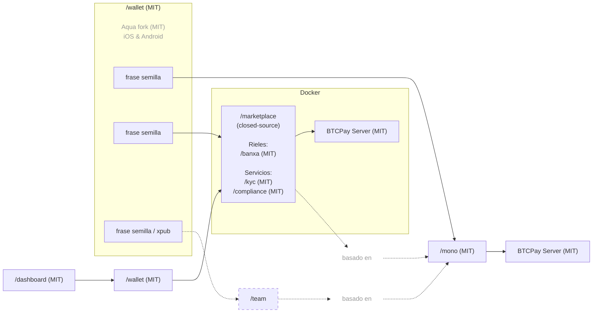

[English](https://github.com/P2Pagos/.github/blob/main/profile/README.md) | [Português](https://github.com/P2Pagos/.github/blob/main/profile/README.pt.md)

# P2Pagos — Infraestructura de pagos multi-rail open source

Infraestructura de pagos open source, modular y agnóstica por diseño para empresas y usuarios que necesitan flujos de pago multi-rail prácticos, liquidación self-custodial y movimientos de dinero transfronterizos más flexibles.

P2Pagos está construido alrededor de **rieles de entrada**, **offramps multi-rail** y liquidación self-custodial. Está diseñado para hacer que la arquitectura de pagos sea más práctica entre mercados, rieles, monedas y jurisdicciones, especialmente donde el acceso a pagos tradicionales es fragmentado, limitado o demasiado dependiente de un solo proveedor.

P2Pagos usa [BTCPay Server](https://github.com/btcpayserver/btcpayserver) como backend y un fork de [Aqua Wallet](https://github.com/AquaWallet/aqua-wallet) como wallet de liquidación por defecto.

[BTCPay Server](https://github.com/btcpayserver/btcpayserver) fue elegido porque es un backend API y GUI probado, ampliamente adoptado y mantenido por la comunidad, con algunos rieles ya integrados. También contribuimos activamente a su [core y ecosistema de plugins](https://github.com/search?q=involves%3Alearntheropes+%28org%3Abtcpayserver+OR+org%3Abtcpayserver-tether+OR+org%3Amempool%29&type=issues).

[Aqua Wallet](https://github.com/AquaWallet/aqua-wallet) fue elegido porque ya soporta liquidación en **BTC on-chain y múltiples stablecoins (USD y BRL por ahora)** por defecto, y puede integrarse desde BTCPay Server mediante el protocolo Shamrock con un flujo de conexión basado en QR.

Donde el cashout local directo todavía no es nativo, P2Pagos ofrece orientación práctica sobre wallets externas, tarjetas y herramientas de off-ramp compatibles para mejorar la usabilidad real en América Latina y otras regiones soportadas. Por ejemplo, para todas las cadenas de liquidación actualmente planificadas, ya consideramos wallets y servicios como [Belo](https://simple.belo.app/app/referral?referralCode=GIOVANNIL), [Revolut](https://revolut.com/referral/?referral-code=giovanni_learntheropes) y [Offramp](https://app.offramp.xyz/login?referralCode=njmlxf), incluyendo rutas compatibles con tarjeta y Google Pay / Apple Pay, mientras que opciones de tarjeta y Google Pay más orientadas a la privacidad podrían agregarse más adelante mediante el trabajo planificado con la API de FixedFloat o mediante colaboración con el emisor.

---

## Enfoque de arquitectura de pagos multi-rail

P2Pagos está diseñado alrededor de algunas decisiones prácticas:

- **Self-custodial por defecto**
- **Agnóstico en la práctica** — el riel utilizable y el camino de liquidación importan más que la ideología
- **Multi-rail por diseño** — diferentes mercados necesitan diferentes formas de pagar y retirar fondos
- **Modular** — rieles de entrada, offramps, flujos y servicios pueden habilitarse o dejarse fuera según el caso de uso
- **Open source** — los componentes públicos permanecen bajo licencia MIT, con mantenimiento y desarrollo a largo plazo sostenidos por ingresos provenientes de la oferta cerrada de pago

Si un riel de entrada no liquida directamente en un activo soportado por el fork de Aqua Wallet, P2Pagos busca convertirlo luego al activo soportado que sea más económico y funcional para ese caso.

---

## Arquitectura

> El código del repo closed-source solo está disponible para miembros del equipo y no para colaboradores externos.  
> Algunos módulos que solo funcionan con el repo closed-source podrían publicarse como open source más adelante para integrarse en proyectos de terceros externos y no relacionados.  
> Al ser un repo closed-source, requiere verificación reforzada para el administrador del marketplace y para usuarios involucrados en transacciones de alto valor.  
> También está pensado para generar ingresos suficientes para mantener todos los repos MIT a largo plazo.  

---

## Multi-Rails de Entrada

| Rail | Estado | Moneda | Métodos de Pago | Liquidación | Comisión | Verificación | Privacidad |
|------|--------|--------|-----------------|-------------|----------|---------------|------------|
| BTC | Implementado | SATS | On-chain y Lightning | Bitcoin On-chain | Ninguna | Ninguna | Total |
| USDT | Implementado | USD | Liquid y Polygon | USDT Liquid y Polygon | Ninguna | Ninguna | Total |
| [Peach](https://github.com/P2Pagos/mono/tree/main/rails/peach) *(integración-api-p2p)* | en pruebas | Global | Cualquiera | Bitcoin On-chain | Alta | Ninguna | Total |
| [RoboSats](https://github.com/P2Pagos/mono/tree/main/rails/robosats) *(integración-api-p2p)* | en pruebas | Global | Cualquiera | Bitcoin On-chain | Alta | Ninguna | Total |
| MoonPay ACH USD *(integración-api-cex)* | en diseño | USD | ACH | Por definir | Por definir | Estándar | Ninguna |
| Mostro *(integración-api-p2p)* | en evaluación | Global | Cualquiera | Bitcoin On-chain | Alta | Ninguna | Total |
| Guardarian *(integración-api-cex)* | planificado | USD, EUR, GBP, CAD, AUD, JPY, TRY, PLN, SEK | Tarjetas de crédito/débito y Google/Apple Pay | Bitcoin On-chain | Media | Ninguna o estándar | Posible (con estructura RUC) |
| Paygate *(integración-api-cex)* | planificado | Global | Tarjetas de crédito/débito | USDT Polygon | Media | Ninguna | Total |
| DePix *(integración-api-cex)* | planificado | BRL | Pix | BRL en Liquid | Baja | Ninguna | Total |
| Kamipay *(integración-api-cex)* | planificado | BRL | Pix | USDT Polygon | Baja | Estándar | Ninguna |
| MtPelerin *(integración-api-cex)* | planificado | EUR y CHF | SEPA | Bitcoin On-chain o USDT Polygon | Baja | Reforzada | Posible (con estructura RUC) |
| Bitzed *(integración-api-cex)* | planificado | ZMW | Mobile | Bitcoin On-chain | Baja | Ninguna | Total |
| Matbea *(integración-api-cex+p2p)* | planificado | RUB | Yandex Pay, Sberbank, Tinkoff, YooMoney, SBP P2P, teléfono móvil | Bitcoin On-chain | Baja | Ninguna | Total |

---

## Offramp Multi-Rail

| Cashout | Estado | Moneda | Métodos de Pago | Verificación |
|---------|--------|--------|-----------------|--------------|
| dLocal | etapa inicial | LATAM / África / Asia y Medio Oriente | transferencia bancaria | Estándar |
| Ueno Bank | después de [moonshot.md](moonshot.md) | PYG / USD | transferencia bancaria / card-popup | Reforzada |
| Freedomia Card | en conversación con el proveedor | liquidaciones limitadas en USD | tarjeta / Google Pay | Ninguna |

Código de referido para dos meses del plan gratuito de [Freedomia](https://www.freedomia.io/a/p2pagos).

---

## Módulos de servicio

| Servicio | Estado | Alcance | Propósito | Por defecto |
|----------|--------|---------|-----------|-------------|
| [ip-detection](https://github.com/P2Pagos/mono/tree/main/services/ip-detection) | en pruebas | global | geolocalización IP y detección de moneda | habilitado por defecto para detección de moneda basada en la ubicación por país de Cloudflare; notas detalladas serán cubiertas en un post separado sobre una vulnerabilidad de Proton VPN ignorada por el equipo de seguridad; ipinfo requiere una API key gratuita de por vida |
| [tor](https://github.com/P2Pagos/mono/tree/main/services/tor) | en pruebas | global | reverse proxy Tor para integraciones onion y basadas en Tor | habilitado si es consumido por un riel habilitado |
| [cors](https://github.com/P2Pagos/mono/tree/main/services/cors) | en pruebas | global | reverse proxy CORS para APIs de destino | habilitado si es consumido por un riel habilitado |
| [market](https://github.com/P2Pagos/mono/tree/main/services/market) | en pruebas | global | agregación de mercado y ofertas externas | habilitado si es consumido por un riel habilitado |
| invoice | planificado | múltiples países, muchos de ellos en LATAM | generación programática de facturas electrónicas al momento de la liquidación del pago, basada en la solución de [Invopop](https://www.invopop.com/), con la publicación de la integración paraguaya SIFEN usando los módulos disponibles de [TIPS SA](https://github.com/TIPS-SA) | deshabilitado por defecto |

---

## Repositorios activos y planificados

### [/mono](https://github.com/P2Pagos/mono)

Repositorio MIT del orquestador single-user.

Ensambla rieles de entrada, flujos de liquidación y servicios de soporte en un solo workspace. El desarrollo activo actualmente está centrado aquí.

### [/wallet](https://github.com/P2Pagos/wallet)

Fork MIT de Aqua Flutter Wallet para P2Pagos, con una app Nuxt embebida para gestionar la configuración de /mono y conectarse a BTCPay mediante el protocolo Shamrock.

### /dashboard

App MIT basada en Nuxt, pensada para gestionar flujos de pago mediante una interfaz embebida en la app Flutter de /wallet.

### /marketplace

Repositorio closed-source para integraciones marketplace multi-user del repo /mono.

Está diseñado para incluir la gestión multi-user por parte del administrador del marketplace, mientras los fondos permanecen siempre bajo control del usuario merchant del marketplace.

Incluirá algunos módulos adicionales actualmente en evaluación:

#### Rieles

- [Cuentas virtuales de Banxa](https://banxa.com/features/fiat/virtual-accounts/): rieles ACH, SEPA, Faster Payments y PayID, todos por confirmar debido a documentación limitada, con datos únicos por merchant.

#### Servicios

- Verificación KYC de merchants.
- Reportes de operaciones financieras para clientes paraguayos según lo requerido por las reglas de cumplimiento de la Resolución DNIT 47/2026.
- Reportes de operaciones financieras para clientes de la UE según lo requerido por la regulación MiCA.

---

## Primeros casos de uso cercanos

Algunos de los casos de uso más claros ya están surgiendo desde nuestra red inmediata.

- Una oportunidad con una **empresa constructora** ya está activa a través de Marta, con demanda real para recibir pagos cripto de mayor valor en Paraguay.
- Un **creador de contenido con audiencia internacional en el espacio de salud y bienestar** quiere abrir una agencia para negocios locales que quieren posicionarse mejor en Google Maps, aparecer en featured snippets y gestionar trabajo relacionado con DNS. En ese flujo, P2Pagos puede ser el método de pago, mientras que los negocios que le pagan pueden estar ubicados en Paraguay, en LATAM en general o incluso en Filipinas.
- Durante un fin de semana reciente en el **Chaco**, otro contacto italiano cercano describió dos líneas de negocio que encajan muy bien con nuestro enfoque de pagos:
  - asistencia con **trámites paraguayos** como cédula, residencia, licencia de conducir, certificado de vida y residencia, y apertura de RUC
  - un **hostel low-cost para mochileros y nómadas digitales** que reservan desde el exterior sin cuentas bancarias paraguayas locales

Algunos de estos negocios pueden ser considerados de alto riesgo por procesadores de pago mainstream, incluso cuando no son inherentemente problemáticos. Nuestro método de pago encaja bien precisamente porque es settlement-first, transfronterizo y menos dependiente de las limitaciones bancarias locales.

---

## Casos de uso para pagos multi-rail

P2Pagos apunta a casos donde los stacks de pago estándar son demasiado limitados, demasiado frágiles o demasiado dependientes de un solo proveedor.

Casos de uso típicos incluyen:

- negocios transfronterizos
- negocios que necesitan rieles de entrada multi-rail
- merchants que quieren liquidación cripto con mayor alcance de pagos
- usuarios en mercados emergentes
- negocios de alto riesgo pero lícitos
- builders que quieren infraestructura de pagos modular y self-hostable
- bitcoiners y entusiastas cripto

No está pensado para presentarse como una solución universal para todo tipo de merchant.

---

## Estado actual

P2Pagos todavía está evolucionando.

Algunos componentes existen como integraciones funcionales, otros son parciales, experimentales o todavía se están ensamblando dentro del orquestador principal. Los repositorios deben leerse como trabajo activo de infraestructura, no como una suite de productos terminada.

---

## Comunidad & Contacto

- [GitHub Discussions](https://github.com/orgs/P2Pagos/discussions)
- [Grupo de Telegram](https://t.me/P2Pagos)
- [p2pagos@p2pay.to](mailto:p2pagos@p2pay.to) con PGP opcional [A1786A2CF6C5B65FDB4519F17E425F745D4EE866](https://pgp.p2pay.to)

---

### Proyecto inspirado por [**BitPagos**](https://web.archive.org/web/20141225131358/https://www.bitpagos.com/es/) en 2014, ahora priorizado como una respuesta open source al reciente lanzamiento de un [Stripe Payments BTCPay Plugin](https://plugin-builder.btcpayserver.org/public/plugins/stripe-payments) con KYC obligatorio, disponibilidad limitada y liquidación fiat.
