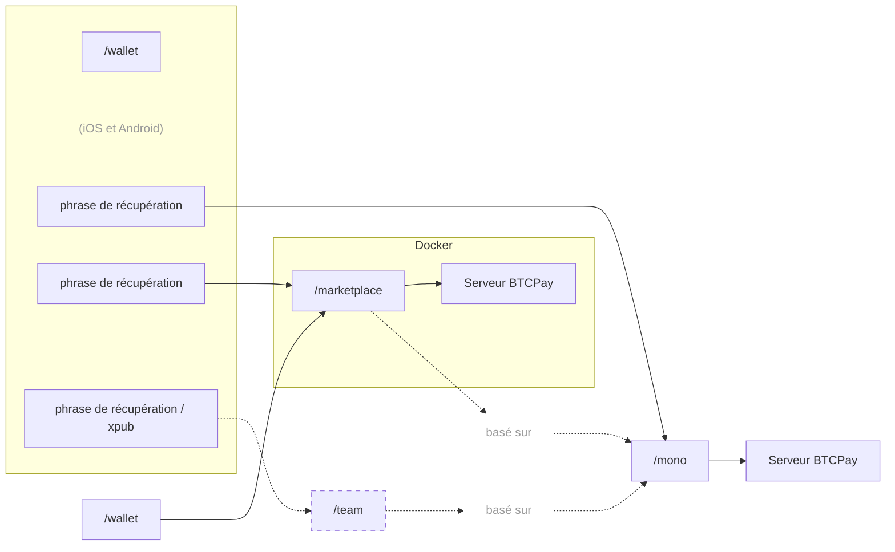

# P2Pagos

Infrastructure de paiement modulaire et open source, construite autour du règlement en Bitcoin et en stablecoins, conçue pour permettre des flux d’intégration et de paiement plus fluides entre marchés et rails. Elle utilise [BTCPay Server](https://github.com/btcpayserver/btcpayserver) comme backend, un fork de [Aqua Wallet](https://github.com/AquaWallet/aqua-wallet) pour le règlement self-custodial, et repose principalement sur [Nuxt](https://github.com/nuxt/nuxt) et [Nitro](https://github.com/nitrojs/nitro).

P2Pagos combine plusieurs rails d’entrée — fiat local, cartes, P2P et crypto — avec un règlement on-chain en Bitcoin, en USDT sur Polygon, ou en autres stablecoins sur Liquid.

Elle est conçue pour les utilisateurs et les entreprises qui ont besoin d’un accès plus simple à des flux de paiement self-custodial et transfrontaliers, y compris dans les marchés où l’accès traditionnel aux paiements est limité.

---

## Approche

P2Pagos est conçue autour de quelques choix pratiques :
- **Self-custodial par défaut**
- **Agnostique en pratique** — le rail utilisable et les règlements offrant le meilleur chemin de conversion comptent davantage que l’idéologie
- **Multi-rail** — différents marchés nécessitent différentes façons de payer
- **Modulaire** — les rails et les flux peuvent être activés ou laissés de côté selon le cas d’usage
- **Open source** — les composants publics restent sous licence MIT, avec la maintenance et le développement à long terme soutenus par les revenus de l’offre payante à code source fermé

Si un rail ne règle pas déjà dans un actif pris en charge par le fork d’Aqua Wallet, P2Pagos vise à convertir davantage vers l’actif pris en charge le moins coûteux et le plus fonctionnel pour ce cas.

---

## Architecture

---

## Intégrations de rails

| Rail | Statut | Devise | Méthodes de paiement | Règlement | Frais | Vérification |
|------|--------|--------|----------------------|-----------|-------|--------------|
| BTC | Implémenté | SATS | On-chain et Lightning | Aucun | Bitcoin On-chain | Aucune | Aucune |
| USDT | Implémenté | USD | Liquid et Polygon | USDT Liquid et Polygon | Aucun | Aucune |
| Peach | en cours | Global | Tout | Bitcoin On-chain | Élevés | Aucune |
| RoboSats | en cours | Global | Tout | Bitcoin On-chain | Élevés | Aucune |
| Mostro | prévu | Global | Tout | Bitcoin On-chain | Élevés | Aucune |
| Guardarian | prévu | USD, EUR, GBP, CAD, AUD, JPY, TRY, PLN, SEK | Cartes de crédit/débit et Google/Apple Pay | Bitcoin On-chain | Moyens | Renforcée |
| Paygate | prévu | Global | Cartes de crédit/débit | USDT Polygon | Moyens | Aucune |
| DePix | prévu | BRL | Pix | BRL sur Liquid | Faibles | Aucune |
| Kamipay | prévu | BRL | Pix | USDT Polygon | Faibles | Aucune |
| MtPelerin | prévu | EUR et CHF | SEPA | Bitcoin On-chain OU USDT Polygon | Faibles | Standard |
| Bitzed | prévu | ZMW | Mobile | Bitcoin On-chain | Faibles | Aucune |
| Matbea | prévu | RUB | Yandex Pay, Sberbank, Tinkoff, YooMoney, SBP P2P, téléphone mobile | Bitcoin On-chain | Faibles | Aucune |

---

## Dépôts actifs et prévus

### [mono](https://github.com/P2Pagos/mono)
Dépôt MIT d’orchestrateur mono-utilisateur. Il rassemble rails, flux et services de support dans un seul workspace. Le développement actif est actuellement centré ici.

### [wallet](https://github.com/P2Pagos/wallet)
Un fork MIT du wallet Flutter Aqua pour P2Pagos, avec une application Nuxt embarquée pour gérer les paramètres de /mono et se connecter à BTCPay via le protocole Shamrock.

### dashboard
Application MIT basée sur Nuxt, destinée à gérer les flux de paiement via une interface embarquée dans l’application Flutter /wallet.

### marketplace
Dépôt closed-source pour les intégrations marketplace multi-utilisateurs du dépôt /mono.

---

## Cas d’usage visés

P2Pagos s’adresse aux cas où les stacks de paiement standards sont trop limités, trop fragiles ou trop dépendants d’un seul fournisseur.

Les cas d’usage typiques incluent :

- les entreprises transfrontalières
- les marchands qui veulent un règlement crypto avec une portée de paiement plus large
- les utilisateurs dans les marchés émergents
- les entreprises à haut risque mais légales
- les builders qui veulent une infrastructure de paiement modulaire et auto-hébergeable
- les bitcoiners et les passionnés de crypto

Elle n’a pas vocation à être présentée comme une solution universelle pour tous les marchands.

---

## Statut

P2Pagos est encore en évolution. Certains composants existent comme intégrations fonctionnelles, d’autres sont partiels, expérimentaux ou encore en cours d’assemblage dans l’orchestrateur principal.

Les dépôts doivent être lus comme un travail actif d’infrastructure, et non comme une suite de produits terminée.

---

## Communauté et contact

- [Discussions GitHub](https://github.com/orgs/P2Pagos/discussions)
- [Groupe Telegram](https://t.me/P2Pagos)
- [p2pagos@p2pay.to](mailto:p2pagos@p2pay.to) avec PGP facultatif [A1786A2CF6C5B65FDB4519F17E425F745D4EE866](https://pgp.p2pay.to)

---

### Projet inspiré par [**BitPagos**](https://web.archive.org/web/20141225131358/https://www.bitpagos.com/es/)
