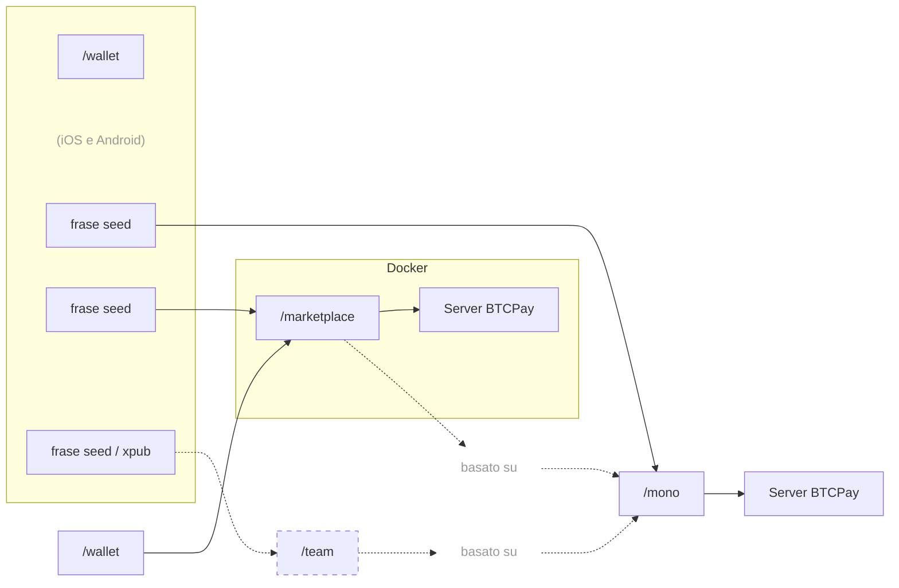

# P2Pagos

Infrastruttura di pagamento modulare e open-source, costruita attorno al settlement in Bitcoin e stablecoin, progettata per rendere più fluidi i flussi di integrazione e di pagamento tra mercati e rail. Utilizza [BTCPay Server](https://github.com/btcpayserver/btcpayserver) come backend, un fork di [Aqua Wallet](https://github.com/AquaWallet/aqua-wallet) per il settlement self-custodial, ed è sviluppata principalmente con [Nuxt](https://github.com/nuxt/nuxt) e [Nitro](https://github.com/nitrojs/nitro).

P2Pagos combina molteplici rail di ingresso — fiat locale, carte, P2P e crypto — con settlement on-chain in Bitcoin, USDT su Polygon o altre stablecoin su Liquid.

È progettata per utenti e aziende che hanno bisogno di un accesso più semplice a flussi di pagamento self-custodial e cross-border, anche in mercati dove l’accesso tradizionale ai pagamenti è limitato.

---

## Approccio

P2Pagos è progettata attorno ad alcune scelte pratiche:
- **Self-custodial di default**
- **Agnostica nella pratica** — il rail utilizzabile e i settlement per il miglior percorso di conversione contano più dell’ideologia
- **Multi-rail** — mercati diversi richiedono modi diversi di pagare
- **Modulare** — rail e flussi possono essere abilitati o esclusi a seconda del caso d’uso
- **Open source** — i componenti pubblici restano concessi in licenza MIT, con manutenzione e sviluppo a lungo termine sostenuti dai ricavi dell’offerta closed-source a pagamento

Se un rail non effettua già settlement in un asset supportato dal fork di Aqua Wallet, P2Pagos punta a convertire ulteriormente nell’asset supportato che sia più economico e più funzionale per quel caso.

---

## Architettura

## Integrazioni dei rail

| Rail | Stato | Valuta | Metodi di pagamento | Settlement | Fee | Verifica |
|------|--------|--------|---------------------|------------|-----|----------|
| BTC | Implementato | SATS | On-chain e Lightning | Nessuno | Bitcoin On-chain | Nessuna | Nessuna |
| USDT | Implementato | USD | Liquid e Polygon | USDT Liquid e Polygon | Nessuna | Nessuna |
| Peach | in corso | Global | Qualsiasi | Bitcoin On-chain | Alta | Nessuna |
| RoboSats | in corso | Global | Qualsiasi | Bitcoin On-chain | Alta | Nessuna |
| Mostro | pianificato | Global | Qualsiasi | Bitcoin On-chain | Alta | Nessuna |
| Guardarian | pianificato | USD, EUR, GBP, CAD, AUD, JPY, TRY, PLN, SEK | Carte di credito/debito e Google/Apple Pay | Bitcoin On-chain | Media | Avanzata |
| Paygate | pianificato | Global | Carte di credito/debito | USDT Polygon | Media | Nessuna |
| DePix | pianificato | BRL | Pix | BRL su Liquid | Bassa | Nessuna |
| Kamipay | pianificato | BRL | Pix | USDT Polygon | Bassa | Nessuna |
| MtPelerin | pianificato | EUR e CHF | SEPA | Bitcoin On-chain OPPURE USDT Polygon | Bassa | Standard |
| Bitzed | pianificato | ZMW | Mobile | Bitcoin On-chain | Bassa | Nessuna |
| Matbea | pianificato | RUB | Yandex Pay, Sberbank, Tinkoff, YooMoney, SBP P2P, telefono mobile | Bitcoin On-chain | Bassa | Nessuna |

---

## Repository attive e pianificate

### [mono](https://github.com/P2Pagos/mono)
Repository MIT con orchestratore single-user. Riunisce rail, flussi e servizi di supporto in un unico workspace. Lo sviluppo attivo è attualmente concentrato qui.

### [wallet](https://github.com/P2Pagos/wallet)
Un fork MIT di Aqua Flutter Wallet per P2Pagos, con un’app Nuxt incorporata per gestire le impostazioni di /mono e collegarsi a BTCPay tramite il protocollo Shamrock.

### dashboard
App MIT basata su Nuxt, pensata per gestire i flussi di pagamento tramite un’interfaccia incorporata nell’app Flutter /wallet.

### marketplace
Repository closed-source per integrazioni marketplace multiutente del repository /mono.

---

## Casi d’uso previsti

P2Pagos è pensata per casi in cui gli stack di pagamento standard sono troppo limitati, troppo fragili o troppo dipendenti da un singolo provider.

I casi d’uso tipici includono:

- aziende cross-border
- merchant che vogliono settlement in crypto con una portata di pagamento più ampia
- utenti nei mercati emergenti
- aziende high-risk ma lecite
- builder che vogliono infrastruttura di pagamento modulare e self-hostable
- bitcoiners e appassionati di crypto

Non è pensata per essere presentata come una soluzione universale per qualsiasi merchant.

---

## Stato

P2Pagos è ancora in evoluzione. Alcuni componenti esistono come integrazioni funzionanti, altri sono parziali, sperimentali o ancora in fase di assemblaggio nell’orchestratore principale.

Le repository vanno lette come lavoro attivo di infrastruttura, non come una suite di prodotti finita.

---

## Comunità e contatti

- [Discussioni su GitHub](https://github.com/orgs/P2Pagos/discussions)
- [Gruppo Telegram](https://t.me/P2Pagos)
- [p2pagos@p2pay.to](mailto:p2pagos@p2pay.to) con PGP opzionale [A1786A2CF6C5B65FDB4519F17E425F745D4EE866](https://pgp.p2pay.to)

---

### Progetto ispirato a [**BitPagos**](https://web.archive.org/web/20141225131358/https://www.bitpagos.com/es/)

