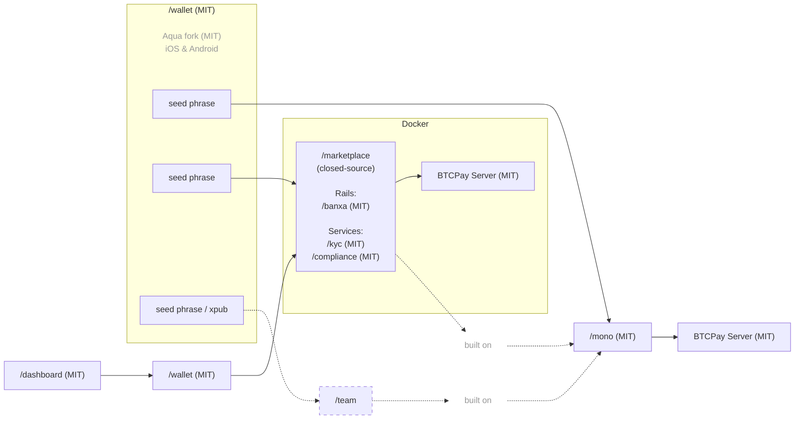

[Español](https://github.com/P2Pagos/.github/blob/main/profile/README.es.md) | [Português](https://github.com/P2Pagos/.github/blob/main/profile/README.pt.md)

# P2Pagos — Open-Source Multi-Rail Payment Infrastructure

Open-source, modular, and agnostic-by-design payment infrastructure for businesses and users that need practical multi-rail payment flows, self-custodial settlement, and more flexible cross-border money movement.

P2Pagos is built around **inbound rails**, **multi-rail offramps**, and self-custodial settlement. It is designed to make payment architecture more practical across markets, rails, currencies, and jurisdictions, especially where traditional payment access is fragmented, limited, or overly dependent on a single provider.

P2Pagos uses [BTCPay Server](https://github.com/btcpayserver/btcpayserver) as the backend and an [Aqua Wallet](https://github.com/AquaWallet/aqua-wallet) fork as the default settlement wallet.

[BTCPay Server](https://github.com/btcpayserver/btcpayserver) was chosen because it is a battle-tested, widely adopted, and community-maintained API and GUI backend with some built-in rails. We also actively contribute to its [core and plugin ecosystem](https://github.com/search?q=involves%3Alearntheropes+%28org%3Abtcpayserver+OR+org%3Abtcpayserver-tether+OR+org%3Amempool%29&type=issues).

[Aqua Wallet](https://github.com/AquaWallet/aqua-wallet) was chosen because it already supports settlement in **BTC on-chain and multiple stablecoins (USD and BRL for now)** by default, and can be integrated from BTCPay Server through the Shamrock protocol with a QR-based connection flow.

Where direct local cashout is not yet native, P2Pagos provides practical guidance around compatible external wallets, cards, and off-ramp tools to improve real usability in Latin America and other supported regions. For instance, across all currently planned settlement chains, we already consider wallets and services such as [Belo](https://simple.belo.app/app/referral?referralCode=GIOVANNIL), [Revolut](https://revolut.com/referral/?referral-code=giovanni_learntheropes), and [Offramp](https://app.offramp.xyz/login?referralCode=njmlxf), including card and Google Pay / Apple Pay compatible paths, while more privacy-friendly card and Google Pay options may later be added through planned FixedFloat API work or collaboration with the issuer.

---

## Multi-Rail Payment Architecture Approach

P2Pagos is designed around a few practical choices:

- **Self-custodial by default**
- **Agnostic in practice** — the usable rail and settlement path matter more than ideology
- **Multi-rail by design** — different markets need different ways to pay and cash out
- **Modular** — inbound rails, offramps, flows, and services can be enabled or left out depending on the use case
- **Open source** — the public components remain MIT licensed, with long-term maintenance and development supported by revenue from the paid closed-source offering

If an inbound rail does not already settle into an asset supported by the Aqua wallet fork, P2Pagos aims to convert it further into the supported asset that is cheapest and most functional for that case.

---

## Architecture

> Closed-source repo code is only available to team members and not to external collaborators.  
> Some modules that only work with the closed-source repo may be open-sourced at a later stage for integration into third-party external and unrelated projects.  
> Because it is a closed-source repo, it requires enhanced verification for the marketplace admin and for users involved in high-value transactions.  
> It is also supposed to generate enough income to maintain all the MIT repos long-term.  

---

## Inbound Multi-Rails

| Rail | Status | Currency | Payment Methods | Settlement | Fee | Verification |
|------|--------|----------|-----------------|------------|-----|--------------|
| BTC | Implemented | SATS | On-chain & Lightning | Bitcoin On-chain | None | None |
| USDT | Implemented | USD | Liquid & Polygon | USDT Liquid & Polygon | None | None |
| [Peach](https://github.com/P2Pagos/mono/tree/main/rails/peach) *(p2p-api-integration)* | testing | Global | Any | Bitcoin On-chain | High | None |
| [RoboSats](https://github.com/P2Pagos/mono/tree/main/rails/robosats) *(p2p-api-integration)* | testing | Global | Any | Bitcoin On-chain | High | None |
| Mostro *(p2p-api-integration)* | evaluating | Global | Any | Bitcoin On-chain | High | None |
| Guardarian *(cex-api-integration)* | planned | USD, EUR, GBP, CAD, AUD, JPY, TRY, PLN, SEK | Credit/Debit Cards & Google/Apple Pay | Bitcoin On-chain | Medium | Enhanced |
| Paygate *(cex-api-integration)* | planned | Global | Credit/Debit Cards | USDT Polygon | Medium | None |
| DePix *(cex-api-integration)* | planned | BRL | Pix | BRL on Liquid | Low | None |
| Kamipay *(cex-api-integration)* | planned | BRL | Pix | USDT Polygon | Low | None |
| MtPelerin *(cex-api-integration)* | planned | EUR & CHF | SEPA | Bitcoin On-chain OR USDT Polygon | Low | Standard |
| Bitzed *(cex-api-integration)* | planned | ZMW | Mobile | Bitcoin On-chain | Low | None |
| Matbea *(cex+p2p-api-integration)* | planned | RUB | Yandex Pay, Sberbank, Tinkoff, YooMoney, SBP P2P, Mobile phone | Bitcoin On-chain | Low | None |

---

## Multi-Rail Offramp

| Cashout | Status | Currency | Payment Methods | Verification |
|---------|--------|----------|-----------------|--------------|
| dLocal | early stage | LATAM / Africa / Asia & Middle East | bank transfer | standard |
| Ueno Bank | post [moonshot.md](moonshot.md) | PYG / USD | bank transfer / card-popup | unknown, but not less than standard |
| Freedomia Card | under discussion with the provider | USD limited settlements | card / Google Pay | none |

Referral code for two months of the [Freedomia](https://www.freedomia.io/a/p2pagos) free plan.

---

## Service Modules

| Service | Status | Scope | Purpose | Default |
|---------|--------|-------|---------|---------|
| [ip-detection](https://github.com/P2Pagos/mono/tree/main/services/ip-detection) | testing | global | IP geolocation and currency detection | enabled by default for currency detection based on Cloudflare country location; detailed notes will be covered in a separate blog post about a Proton VPN vulnerability ignored by the security team; ipinfo requires a free lifetime API key |
| [tor](https://github.com/P2Pagos/mono/tree/main/services/tor) | testing | global | Tor reverse proxy for onion and Tor-based integrations | enabled if consumed by an enabled rail |
| [cors](https://github.com/P2Pagos/mono/tree/main/services/cors) | testing | global | CORS reverse proxy for target APIs | enabled if consumed by an enabled rail |
| [market](https://github.com/P2Pagos/mono/tree/main/services/market) | testing | global | market aggregation and external offers | enabled if consumed by an enabled rail |
| invoice | planned | multiple countries, many of them in LATAM | Programmatic electronic invoice generation upon payment settlement based on the [Invopop](https://www.invopop.com/) solution, with us releasing the Paraguayan SIFEN integration using the available [TIPS SA](https://github.com/TIPS-SA) modules | disabled by default |

---

## Active and Planned Repositories

### [/mono](https://github.com/P2Pagos/mono)

Single-user orchestrator MIT repository.

It assembles inbound rails, settlement flows, and supporting services into one workspace. Active development is currently centered here.

### [/wallet](https://github.com/P2Pagos/wallet)

An MIT fork of the Aqua Flutter Wallet for P2Pagos, with an embedded Nuxt app to manage /mono settings and connect to BTCPay via the Shamrock protocol.

### /dashboard

Nuxt-based MIT app intended to handle payment flows through an embedded interface in the /wallet Flutter app.

### /marketplace

Closed-source repository for multi-user marketplace integrations of the /mono repo.

It is designed to include multi-user management by the marketplace admin, while funds always remain under the control of the marketplace merchant user.

It will include some additional modules currently under evaluation:

#### Rails

- [Banxa virtual accounts](https://banxa.com/features/fiat/virtual-accounts/): ACH, SEPA, Faster Payments, and PayID rails, all to be confirmed due to poor documentation, with merchant-unique details.

#### Services

- Merchant KYC verification.
- Financial operations reporting for Paraguayan clients as required by the Resolución DNIT 47/2026 compliance rules.
- Financial operations reporting for EU clients as required by the MiCA regulation.

---

## Early Use Cases Around Us

Some of the clearest use cases are already emerging from our immediate network.

- A **construction company** opportunity is already active through Marta, with real demand for receiving higher-value crypto payments in Paraguay.
- A **content creator with an international audience in the health and wellness space** wants to open an agency for local businesses that want to rank better on Google Maps, appear in featured snippets, and manage DNS-related work. In that flow, P2Pagos can be the payment method, while the businesses paying him may be located in Paraguay, broader LATAM, or even the Philippines.
- During a recent weekend in the **Chaco**, another close Italian contact described two business lines that fit our payment approach very well:
  - assistance with **Paraguayan paperwork** such as cédula, residency, driver’s license, certificado de vida y residencia, and RUC opening
  - a **low-cost hostel for backpackers and digital nomads** booking from abroad without local Paraguayan bank accounts

Some of these businesses may be considered high-risk by mainstream payment processors even when they are not inherently problematic. Our payment method fits them well precisely because it is settlement-first, cross-border, and less dependent on local banking constraints.

---

## Use Cases for Multi-Rail Payments

P2Pagos is aimed at cases where standard payment stacks are too limited, too fragile, or too dependent on a single provider.

Typical use cases include:

- cross-border businesses
- businesses that need multi-rail inbound payments
- merchants that want crypto settlement with broader payment reach
- users in emerging markets
- high-risk but lawful businesses
- builders that want modular, self-hostable payment infrastructure
- Bitcoiners and crypto enthusiasts

It is not meant to be presented as a universal fit for every merchant.

---

## Current Status

P2Pagos is still evolving.

Some components exist as working integrations, others are partial, experimental, or still being assembled into the main orchestrator. The repositories should be read as active infrastructure work, not as a finished product suite.

---

## Community & Contact

- [GitHub Discussions](https://github.com/orgs/P2Pagos/discussions)
- [Telegram Group](https://t.me/P2Pagos)
- [p2pagos@p2pay.to](mailto:p2pagos@p2pay.to) with optional PGP [A1786A2CF6C5B65FDB4519F17E425F745D4EE866](https://pgp.p2pay.to)

---

### Project inspired by [**BitPagos**](https://web.archive.org/web/20141225131358/https://www.bitpagos.com/es/) in 2014, now prioritized as an open-source response to the recent release of a KYC-mandatory, limited-availability, fiat-settled [Stripe Payments BTCPay Plugin](https://plugin-builder.btcpayserver.org/public/plugins/stripe-payments).
