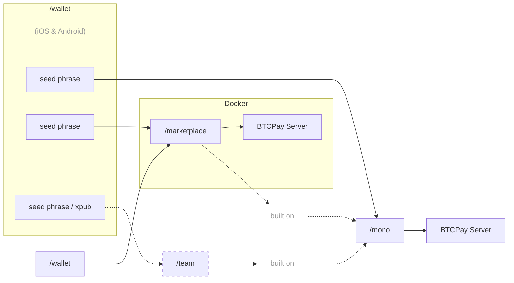

[Español](https://github.com/P2Pagos/.github/blob/main/profile/README.es.md) | [Português](https://github.com/P2Pagos/.github/blob/main/profile/README.pt.md) | [Русский](https://github.com/P2Pagos/.github/blob/main/profile/README.ru.md) | [Français](https://github.com/P2Pagos/.github/blob/main/profile/README.fr.md) | [Italiano](https://github.com/P2Pagos/.github/blob/main/profile/README.it.md)

> Translations may be outdated.  
> Las traducciones pueden estar desactualizadas.

# P2Pagos

Open-source, modular payment infrastructure built around Bitcoin- and stablecoin-based settlement, designed to enable more frictionless integration and payment flows across markets and rails.

It uses [BTCPay Server](https://github.com/btcpayserver/btcpayserver) as the backend, an [Aqua Wallet](https://github.com/AquaWallet/aqua-wallet) fork for self-custodial settlement, and is primarily built with [Nuxt](https://github.com/nuxt/nuxt) and [Nitro](https://github.com/nitrojs/nitro). P2Pagos combines multiple entry rails — local fiat, cards, P2P, and crypto — with on-chain settlement in Bitcoin, USDT on Polygon, or other stablecoins on Liquid.

It is designed for users and businesses that need simpler access to self-custodial, cross-border payment flows, including in markets where traditional payment access is limited.

---

## Approach

P2Pagos is designed around a few practical choices:

- **Self-custodial by default**
- **Agnostic in practice** — the usable rail and settlements for best conversion path matter more than ideology
- **Multi-rail** — different markets need different ways to pay
- **Modular** — rails, flows, and services can be enabled or left out depending on the use case
- **Open source** — the public components remain MIT licensed, with long-term maintenance and development supported by revenue from the paid closed-source offering

If a rail does not already settle into an asset supported by the Aqua wallet fork, P2Pagos aims to convert further into the supported asset that is cheapest and most functional for that case.

---

## Architecture

---

## Rail Integrations

| Rail | Status | Currency | Payment Methods | Settlement | Fee | Verification |
|------|--------|----------|-----------------|------------|-----|--------------|
| BTC | Implemented | SATS | On-chain & Lightning | Bitcoin On-chain | None | None |
| USDT | Implemented | USD | Liquid & Polygon | USDT Liquid & Polygon | None | None |
| Peach *(p2p-api-integration)* | ongoing | Global | Any | Bitcoin On-chain | High | None |
| RoboSats *(p2p-api-integration)* | ongoing | Global | Any | Bitcoin On-chain | High | None |
| Mostro *(p2p-api-integration)* | planned | Global | Any | Bitcoin On-chain | High | None |
| Guardarian *(cex-api-integration)* | planned | USD, EUR, GBP, CAD, AUD, JPY, TRY, PLN, SEK | Credit/Debit Cards & Google/Apple Pay | Bitcoin On-chain | Medium | Enhanced |
| Paygate *(cex-api-integration)* | planned | Global | Credit/Debit Cards | USDT Polygon | Medium | None |
| DePix *(cex-api-integration)* | planned | BRL | Pix | BRL on Liquid | Low | None |
| Kamipay *(cex-api-integration)* | planned | BRL | Pix | USDT Polygon | Low | None |
| MtPelerin *(cex-api-integration)* | planned | EUR & CHF | SEPA | Bitcoin On-chain OR USDT Polygon | Low | Standard |
| Bitzed *(cex-api-integration)* | planned | ZMW | Mobile | Bitcoin On-chain | Low | None |
| Matbea *(cex+p2p-api-integration)* | planned | RUB | Yandex Pay, Sberbank, Tinkoff, YooMoney, SBP P2P, Mobile phone | Bitcoin On-chain | Low | None |

---

## Service Modules

| Service | Status | Scope | Purpose | Default |
|---------|--------|-------|---------|---------|
| ip-detection | testing | global | IP geolocation and currency detection | optional by default |
| tor | testing | global | Tor reverse proxy for onion and Tor-based integrations | optional by default |
| market | testing | global | market aggregation and external offers | optional by default |
| kyc-kyb | defined | worldwide | KYC / KYB | optional by default |
| invoicing-reporting-py | in planning | Paraguay | invoicing and reporting | optional by default |

---

## Active and Planned Repositories

### [mono](https://github.com/P2Pagos/mono)

Single user orchestrator MIT repository.

It assembles rails, flows, and supporting services into one workspace. Active development is currently centered here.

### [wallet](https://github.com/P2Pagos/wallet)

A MIT fork of the Aqua Flutter Wallet for P2Pagos, with an embedded Nuxt app to manage /mono settings and connect to BTCPay via the Shamrock protocol.

### dashboard

Nuxt-based MIT app, intended to handle payment flows through an embedded interface in the /wallet Flutter app.

### marketplace

Closed-source repository for multi-user marketplace integrations of the /mono repo.

---

## Intended Use Cases

P2Pagos is aimed at cases where standard payment stacks are too limited, too fragile, or too dependent on a single provider.

Typical use cases include:

- cross-border businesses
- merchants that want crypto settlement with broader payment reach
- users in emerging markets
- high-risk but lawful businesses
- builders who want modular, self-hostable payment infrastructure
- Bitcoiners and crypto enthusiasts

It is not meant to be presented as a universal fit for every merchant.

---

## Status

P2Pagos is still evolving.

Some components exist as working integrations, others are partial, experimental, or still being assembled into the main orchestrator. The repositories should be read as active infrastructure work, not as a finished product suite.

---

## Community & Contact

- [GitHub Discussions](https://github.com/orgs/P2Pagos/discussions)
- [Telegram Group](https://t.me/P2Pagos)
- [p2pagos@p2pay.to](mailto:p2pagos@p2pay.to) with optional PGP [A1786A2CF6C5B65FDB4519F17E425F745D4EE866](https://pgp.p2pay.to)

---

### Project inspired by [**BitPagos**](https://web.archive.org/web/20141225131358/https://www.bitpagos.com/es/)
- [Telegram Group](https://t.me/P2Pagos)
- [p2pagos@p2pay.to](mailto:p2pagos@p2pay.to) with optional PGP [A1786A2CF6C5B65FDB4519F17E425F745D4EE866](https://pgp.p2pay.to)

---

### Project inspired by [**BitPagos**](https://web.archive.org/web/20141225131358/https://www.bitpagos.com/es/)
