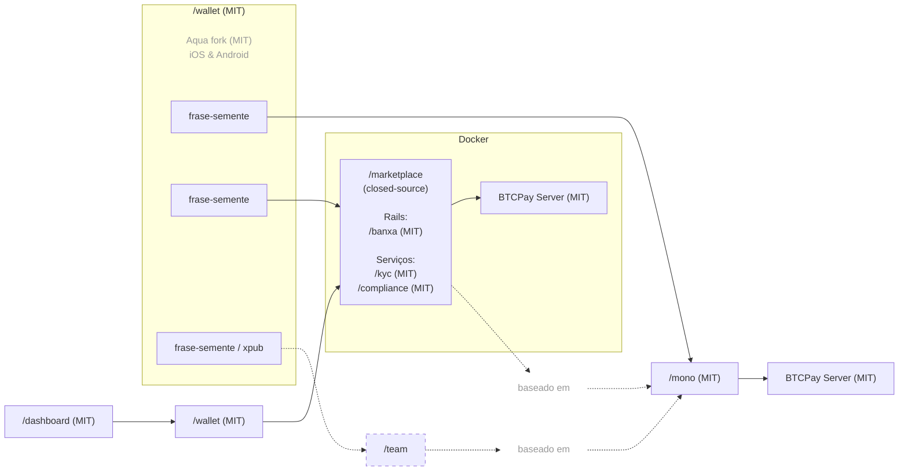

[English](https://github.com/P2Pagos/.github/blob/main/profile/README.md) | [Español](https://github.com/P2Pagos/.github/blob/main/profile/README.es.md)

# P2Pagos — Infraestrutura de pagamentos multi-rail open source

Infraestrutura de pagamentos open source, modular e agnóstica por design para empresas e usuários que precisam de fluxos de pagamento multi-rail práticos, liquidação self-custodial e movimentação internacional de dinheiro com mais flexibilidade.

P2Pagos é construído em torno de **rails de entrada**, **offramps multi-rail** e liquidação self-custodial. Ele foi projetado para tornar a arquitetura de pagamentos mais prática entre mercados, rails, moedas e jurisdições, especialmente onde o acesso a pagamentos tradicionais é fragmentado, limitado ou excessivamente dependente de um único provedor.

P2Pagos usa [BTCPay Server](https://github.com/btcpayserver/btcpayserver) como backend e um fork da [Aqua Wallet](https://github.com/AquaWallet/aqua-wallet) como wallet de liquidação padrão.

[BTCPay Server](https://github.com/btcpayserver/btcpayserver) foi escolhido porque é um backend API e GUI testado em produção, amplamente adotado e mantido pela comunidade, com alguns rails já integrados. Também contribuímos ativamente para seu [core e ecossistema de plugins](https://github.com/search?q=involves%3Alearntheropes+%28org%3Abtcpayserver+OR+org%3Abtcpayserver-tether+OR+org%3Amempool%29&type=issues).

[Aqua Wallet](https://github.com/AquaWallet/aqua-wallet) foi escolhida porque já suporta liquidação em **BTC on-chain e múltiplas stablecoins (USD e BRL por enquanto)** por padrão, e pode ser integrada ao BTCPay Server por meio do protocolo Shamrock com um fluxo de conexão baseado em QR.

Onde o cashout local direto ainda não é nativo, P2Pagos oferece orientação prática sobre wallets externas, cartões e ferramentas de off-ramp compatíveis para melhorar a usabilidade real na América Latina e em outras regiões suportadas. Por exemplo, em todas as cadeias de liquidação atualmente planejadas, já consideramos wallets e serviços como [Belo](https://simple.belo.app/app/referral?referralCode=GIOVANNIL), [Revolut](https://revolut.com/referral/?referral-code=giovanni_learntheropes) e [Offramp](https://app.offramp.xyz/login?referralCode=njmlxf), incluindo caminhos compatíveis com cartão e Google Pay / Apple Pay, enquanto opções de cartão e Google Pay mais orientadas à privacidade poderão ser adicionadas mais adiante por meio do trabalho planejado com a API da FixedFloat ou por colaboração com o emissor.

---

## Abordagem de arquitetura de pagamentos multi-rail

P2Pagos é projetado em torno de algumas escolhas práticas:

- **Self-custodial por padrão**
- **Agnóstico na prática** — o rail utilizável e o caminho de liquidação importam mais do que a ideologia
- **Multi-rail por design** — mercados diferentes precisam de formas diferentes de pagar e sacar
- **Modular** — rails de entrada, offramps, fluxos e serviços podem ser habilitados ou deixados de fora conforme o caso de uso
- **Open source** — os componentes públicos permanecem sob licença MIT, com manutenção e desenvolvimento de longo prazo sustentados pela receita da oferta paga closed-source

Se um rail de entrada ainda não liquida diretamente em um ativo suportado pelo fork da Aqua Wallet, P2Pagos busca convertê-lo depois para o ativo suportado que seja mais barato e funcional para aquele caso.

---

## Arquitetura

> O código do repo closed-source está disponível apenas para membros da equipe e não para colaboradores externos.  
> Alguns módulos que só funcionam com o repo closed-source poderão ser publicados como open source em uma etapa posterior para integração em projetos de terceiros externos e não relacionados.  
> Por ser um repo closed-source, ele exige verificação reforçada para o administrador do marketplace e para usuários envolvidos em transações de alto valor.  
> Ele também deve gerar receita suficiente para manter todos os repos MIT no longo prazo.  

---

## Multi-Rails de Entrada

| Rail | Status | Moeda | Métodos de Pagamento | Liquidação | Taxa | Verificação | Privacidade |
|------|--------|-------|----------------------|------------|------|--------------|-------------|
| BTC | Implementado | SATS | On-chain e Lightning | Bitcoin On-chain | Nenhuma | Nenhuma | Total |
| USDT | Implementado | USD | Liquid e Polygon | USDT Liquid e Polygon | Nenhuma | Nenhuma | Total |
| [Peach](https://github.com/P2Pagos/mono/tree/main/rails/peach) *(integração-api-p2p)* | em testes | Global | Qualquer um | Bitcoin On-chain | Alta | Nenhuma | Total |
| [RoboSats](https://github.com/P2Pagos/mono/tree/main/rails/robosats) *(integração-api-p2p)* | em testes | Global | Qualquer um | Bitcoin On-chain | Alta | Nenhuma | Total |
| MoonPay ACH USD *(integração-api-cex)* | em desenho | USD | ACH | A definir | A definir | Padrão | Nenhuma |
| Mostro *(integração-api-p2p)* | em avaliação | Global | Qualquer um | Bitcoin On-chain | Alta | Nenhuma | Total |
| Guardarian *(integração-api-cex)* | planejado | USD, EUR, GBP, CAD, AUD, JPY, TRY, PLN, SEK | Cartões de crédito/débito e Google/Apple Pay | Bitcoin On-chain | Média | Nenhuma ou padrão | Possível (com estrutura RUC) |
| Paygate *(integração-api-cex)* | planejado | Global | Cartões de crédito/débito | USDT Polygon | Média | Nenhuma | Total |
| DePix *(integração-api-cex)* | planejado | BRL | Pix | BRL na Liquid | Baixa | Nenhuma | Total |
| Kamipay *(integração-api-cex)* | planejado | BRL | Pix | USDT Polygon | Baixa | Padrão | Nenhuma |
| MtPelerin *(integração-api-cex)* | planejado | EUR e CHF | SEPA | Bitcoin On-chain ou USDT Polygon | Baixa | Reforçada | Possível (com estrutura RUC) |
| Bitzed *(integração-api-cex)* | planejado | ZMW | Mobile | Bitcoin On-chain | Baixa | Nenhuma | Total |
| Matbea *(integração-api-cex+p2p)* | planejado | RUB | Yandex Pay, Sberbank, Tinkoff, YooMoney, SBP P2P, telefone móvel | Bitcoin On-chain | Baixa | Nenhuma | Total |

---

## Offramp Multi-Rail

| Cashout | Status | Moeda | Métodos de Pagamento | Verificação |
|---------|--------|-------|----------------------|-------------|
| dLocal | etapa inicial | LATAM / África / Ásia e Oriente Médio | transferência bancária | Padrão |
| Ueno Bank | após [moonshot.md](moonshot.md) | PYG / USD | transferência bancária / card-popup | Reforçada |
| Freedomia Card | em conversa com o provedor | liquidações limitadas em USD | cartão / Google Pay | Nenhuma |

Código de indicação para dois meses do plano gratuito da [Freedomia](https://www.freedomia.io/a/p2pagos).

---

## Módulos de serviço

| Serviço | Status | Escopo | Propósito | Padrão |
|---------|--------|--------|-----------|--------|
| [ip](https://github.com/P2Pagos/mono/tree/main/services/ip) | em testes | global | geolocalização por IP e detecção de moeda | habilitado por padrão para detecção de moeda com base na localização por país da Cloudflare; notas detalhadas serão abordadas em um post separado sobre uma vulnerabilidade da Proton VPN ignorada pela equipe de segurança; ipinfo exige uma API key gratuita vitalícia |
| [tor](https://github.com/P2Pagos/mono/tree/main/services/tor) | em testes | global | reverse proxy Tor para integrações onion e baseadas em Tor | habilitado se consumido por um rail habilitado |
| [cors](https://github.com/P2Pagos/mono/tree/main/services/cors) | em testes | global | reverse proxy CORS para APIs de destino | habilitado se consumido por um rail habilitado |
| [market](https://github.com/P2Pagos/mono/tree/main/services/market) | em testes | global | agregação de mercado e ofertas externas | habilitado se consumido por um rail habilitado |
| invoice | planejado | Entre ellos, el módulo de facturación: generación programática de facturas electrónicas activada en la liquidación, de código abierto, basada en la solución Invopop y extendida con la integración paraguaya de SIFEN mediante los módulos de TIPS SA, con soporte para múltiples países de LATAM. | desabilitado por padrão |

---

## Repositórios ativos e planejados

### [/mono](https://github.com/P2Pagos/mono)

Repositório MIT do orquestrador single-user.

Ele reúne rails de entrada, fluxos de liquidação e serviços de suporte em um único workspace. O desenvolvimento ativo está atualmente concentrado aqui.

### [/wallet](https://github.com/P2Pagos/wallet)

Fork MIT da Aqua Flutter Wallet para P2Pagos, com um app Nuxt embutido para gerenciar a configuração de /mono e conectar-se ao BTCPay por meio do protocolo Shamrock.

### /dashboard

App MIT baseado em Nuxt, pensado para gerenciar fluxos de pagamento por meio de uma interface embutida no app Flutter de /wallet.

### /marketplace

Repositório closed-source para integrações marketplace multi-user do repo /mono.

Ele foi projetado para incluir a gestão multi-user pelo administrador do marketplace, enquanto os fundos permanecem sempre sob controle do usuário merchant do marketplace.

Ele incluirá alguns módulos adicionais atualmente em avaliação:

#### Rails

- [Contas virtuais da Banxa](https://banxa.com/features/fiat/virtual-accounts/): rails ACH, SEPA, Faster Payments e PayID, todos a confirmar devido à documentação limitada, com dados únicos por merchant.

#### Serviços

- Verificação KYC de merchants.
- Relatórios de operações financeiras para clientes paraguaios conforme exigido pelas regras de compliance da Resolução DNIT 47/2026.
- Relatórios de operações financeiras para clientes da UE conforme exigido pela regulamentação MiCA.

---

## Primeiros casos de uso próximos

Alguns dos casos de uso mais claros já estão surgindo dentro da nossa rede imediata.

- Uma oportunidade com uma **empresa de construção** já está ativa por meio da Marta, com demanda real para receber pagamentos cripto de maior valor no Paraguai.
- Um **criador de conteúdo com audiência internacional no espaço de saúde e bem-estar** quer abrir uma agência para negócios locais que desejam se posicionar melhor no Google Maps, aparecer em featured snippets e gerenciar trabalho relacionado a DNS. Nesse fluxo, P2Pagos pode ser o método de pagamento, enquanto os negócios que pagam a ele podem estar localizados no Paraguai, na LATAM em geral ou até nas Filipinas.
- Durante um fim de semana recente no **Chaco**, outro contato italiano próximo descreveu duas linhas de negócio que se encaixam muito bem com nossa abordagem de pagamentos:
  - assistência com **trâmites paraguaios** como cédula, residência, carteira de motorista, certificado de vida e residência, e abertura de RUC
  - um **hostel low-cost para mochileiros e nômades digitais** que fazem reservas do exterior sem contas bancárias paraguaias locais

Alguns desses negócios podem ser considerados de alto risco por processadores de pagamento mainstream, mesmo quando não são inerentemente problemáticos. Nosso método de pagamento se encaixa bem justamente porque é settlement-first, internacional e menos dependente das limitações bancárias locais.

---

## Casos de uso para pagamentos multi-rail

P2Pagos é voltado para casos em que os stacks de pagamento padrão são limitados demais, frágeis demais ou dependentes demais de um único provedor.

Casos de uso típicos incluem:

- negócios internacionais
- negócios que precisam de rails de entrada multi-rail
- merchants que querem liquidação cripto com maior alcance de pagamentos
- usuários em mercados emergentes
- negócios de alto risco, mas lícitos
- builders que querem infraestrutura de pagamentos modular e self-hostable
- bitcoiners e entusiastas cripto

Ele não deve ser apresentado como uma solução universal para todo tipo de merchant.

---

## Status atual

P2Pagos ainda está evoluindo.

Alguns componentes existem como integrações funcionais, outros são parciais, experimentais ou ainda estão sendo reunidos dentro do orquestrador principal. Os repositórios devem ser lidos como trabalho ativo de infraestrutura, não como uma suíte de produtos finalizada.

---

## Comunidade & Contato

- [GitHub Discussions](https://github.com/orgs/P2Pagos/discussions)
- [Grupo do Telegram](https://t.me/P2Pagos)
- [p2pagos@p2pay.to](mailto:p2pagos@p2pay.to) com PGP opcional [A1786A2CF6C5B65FDB4519F17E425F745D4EE866](https://pgp.p2pay.to)

---

### Projeto inspirado pelo [**BitPagos**](https://web.archive.org/web/20141225131358/https://www.bitpagos.com/es/](https://web.archive.org/web/20141229220849/https://www.bitpagos.com/pt/) em 2014, agora priorizado como uma resposta open source ao lançamento recente de um [Stripe Payments BTCPay Plugin](https://plugin-builder.btcpayserver.org/public/plugins/stripe-payments) com KYC obrigatório, disponibilidade limitada e liquidação em fiat.
